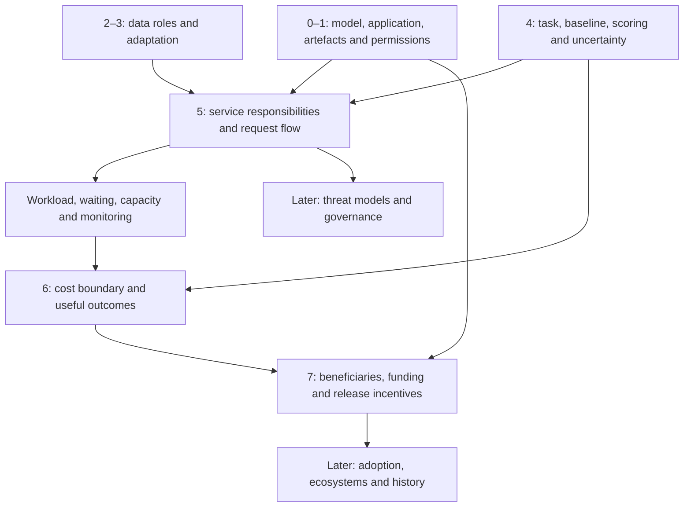

# Next section: Operating Models and Economics

Research and editorial decision: 16 September 2026. **Authoring plan, not an available section.** The published draft has five chapters. This phase starts the next section; it does not reinstate the archived book or change the active manifest.

## Reader gap and proposed destination

After Chapter 4 a reader can compare answers under stated conditions. They cannot yet explain what happens when requests arrive together, who keeps an application working, or why a free model download can still be expensive to use. Those are prerequisites for evaluating both procurement claims and arguments about release strategy.

The section will help readers defend a conditional operating choice: what to run, who should operate it, what it would cost under explicit assumptions, and what dependencies remain. It has **three chapters**, with provisional display numbers 5–7. No coding, paid accounts or hardware purchases are required.

## Source comparison

All passages below were inspected on 16 September 2026. These are ten resources: five teaching/technical resources and five authored economic or strategic arguments. They are not ten independent empirical studies of teaching effectiveness. Audience descriptions and suggested teaching uses are editorial judgments. Sources support mechanisms or their authors' stated arguments; inspection does not establish every factual premise in the surrounding document.

| Resource and edition/date | Audience and prerequisites | Inspected passage; overlap and next concepts | Teaching use and limits |
|---|---|---|---|
| [Stanford CS336, Spring 2025, lecture 10](https://github.com/stanford-cs336/spring2025-lectures/blob/main/lecture_10.py#L53-L68), scheduled 1 May 2025 | Advanced students comfortable with Python, linear algebra and systems | `landscape`, `arithmetic_intensity_of_inference`, `throughput_and_latency`, `quantization`: starts with inference already covered in our primer, then distinguishes first-token delay, generation rate, total throughput and memory use. [Raw lesson](https://raw.githubusercontent.com/stanford-cs336/spring2025-lectures/main/lecture_10.py) inspected. | Adopt the workload-first questions. Keep derivations optional. The lecture's idealized hardware calculations are not measured service performance; its shorthand about memory limits is conditional on the workload and model assumptions. Do not copy hardware numbers into a universal rule. |
| [Hugging Face Transformers, KV cache strategies, v4.50.0](https://huggingface.co/docs/transformers/v4.50.0/kv_cache#memory-efficient-caches) | Developers who know generation and Python | Introduction, Default cache, Memory efficient caches, Offloaded cache, Quantized cache. Builds on context and token generation by explaining reusable intermediate calculations and memory/speed trade-offs. | Explain a cache as saved intermediate work before naming KV vectors. The quantized-cache passage explicitly warns that lower memory use can worsen latency. Version pinned; no claim that this is the latest API, no code execution or measured speed comparison. |
| [Google ML Crash Course, Production ML systems](https://developers.google.com/machine-learning/crash-course/production-ml-systems), updated 25 August 2025 | Learners with basic ML, data and overfitting knowledge | Opening lesson and Figure 1 description: data verification, configuration, resource management, monitoring and serving surround the model. Overlaps the model/application distinction and extends it to ongoing responsibilities. | Use a component-and-owner map with an original library example. Do not carry over its numerical claim about the proportion of model code: no underlying measurement was inspected. Subsequent lessons were not reviewed in this pass. |
| [Chip Huyen, Designing Machine Learning Systems](https://github.com/chiphuyen/dmls-book/blob/main/summary.md#chapter-7-model-deployment-and-prediction-service), 2022, public companion summaries | ML practitioners moving toward production; engineering vocabulary assumed | Summaries of Chapters 2, 7 and 8: requirements, deployment routes and monitoring. Evaluation precedes deployment in the book, matching our present position. | Useful sequencing support and contrasts between interactive/batch and cloud/device operation. Only the author's summaries were read, not the full commercial chapters or exercises. Predictions about future deployment patterns remain predictions. |
| [Josh Tobin, FSDL LLM Bootcamp: LLMOps](https://fullstackdeeplearning.com/llm-bootcamp/spring-2023/llmops/#deployment-and-monitoring), 9 May 2023 | Application builders; software and model-use familiarity | Written sections Choosing your base LLM, Deployment and monitoring, Test-driven development for LLMs. Connects evaluation, deployment and feedback. | Borrow the loop from observed failure to revision and retesting. Written summaries only; video and slides not reviewed. Exclude 2023 provider rankings and blanket security comparisons. This is not a current purchasing guide. |
| [Joel Spolsky, Strategy Letter V](https://www.joelonsoftware.com/2002/06/12/strategy-letter-v/), 12 June 2002 | General technology/business readers; no specialist economics needed | Opening substitutes/complements explanation, opportunity-cost discussion, closing switching-cost example. Supplies economic vocabulary absent from Chapters 0–4. | Use original examples to define a complement and the cost of changing systems. Treat the essay's corporate explanations as arguments, not verified accounts of private motives. Historical company cases need separate checking if reused. |
| [Mark Zuckerberg, Open Source AI is the Path Forward](https://about.fb.com/news/2024/07/open-source-ai-is-the-path-forward/), 23 July 2024 | Developers and public/business readers | “Why Open Source AI Is Good for Meta”: ecosystem investment and reducing platform dependence. Builds on our release-permission distinctions. | A dated first-person explanation of strategy, contrasted with user and maintainer interests. Do not adopt the essay's cost percentages, capability rankings, predictions or safety comparisons. Its terminology does not override Chapter 1's definition of openness. Existing source E14. |
| [Nathan Lambert, Why I build open language models](https://www.interconnects.ai/p/why-i-build-open-language-models), 30 October 2024 | AI research/community readers | Opening rationale and “Bending the trajectory of progress”: models and documentation as research infrastructure. | Preserve the research-access and maintenance perspective alongside commercial incentives. Do not treat its broad social and security expectations as demonstrated outcomes. Existing E16. |
| [Bill Gurley, From Open Source Software to Open Source Strategy](https://p3institute.substack.com/p/from-open-source-software-to-open), 9 May 2026 | Business/technology readers | “Open Source Strategy: How It Works”: shared standards, supplier dependence and defensive strategy. | Compare a plausible strategic explanation with alternatives. Exclude its universal claim of superior code/security and unverified numerical historical examples. Existing E13; preserve the named author rather than silently absorbing his position into the book's voice. |
| [Christian Catalini, Some Simple Economics of Open versus Closed AI](https://www.a16z.news/p/some-simple-economics-of-open-versus), 11 August 2026 | Readers of economic and AI debates; benefits from an introduction to incentives | Opening allocation argument; “To Monopoly or Not To Monopoly?” and “Idea Compounding.” Contrasts funding an initial investment with enabling later experimentation. | Present this as an argument about innovation incentives. The cited historical empirical studies were not inspected here; their percentages and claimed transfer to AI are excluded. Legal assertions and allegations also remain outside this section. Existing E15. |

### Additional inspection and exclusions

- [Chip Huyen's generation-configuration article](https://huyenchip.com/2024/01/16/sampling.html), 16 January 2024: inspected as a possible bridge, but repeats foundations/adaptation material. Do not use its broad causal claims about hallucinations or its historical provider settings here.
- The [PagedAttention paper HTML v2](https://arxiv.org/html/2309.06180v2) could not be retrieved in this pass. It is a follow-up source, **not inspected evidence**. No speedup from it is used.
- [HF's Flash Attention introduction](https://huggingface.co/docs/text-generation-inference/en/conceptual/flash_attention) was inspected but is too low-level for this section's required path. Detailed attention kernels are deferred.
- No hosted service was purchased or benchmarked. No current prices, market shares or real deployment savings are asserted.

## Concept dependencies

Plain-language route: know what the system must do → identify the work and its owner → compare the resources and costs for the same outcome → examine who benefits from different release and operating choices. An inexpensive download does not answer the later questions.

First-use teaching needed: **service** (an application made available to users); **workload** (the volume, timing and kinds of requests); **latency** (time for a specified response milestone); **throughput** (completed work per time period); **capacity** (work that can be handled under stated conditions); **utilization** (share of available capacity actually used); **fixed/variable cost** (relative to a defined period and activity); **complement** (something used alongside another product); **switching cost** (work and expense of moving to an alternative). Introduce each through an example before using it in a task.

## Two candidate sequences

| | Sequence A: service first | Sequence B: budget first |
|---|---|---|
| Chapter order | From model to service → What it costs to deliver a useful answer → Why organizations release models | What a useful answer costs → Choosing how to run it → Who funds the ecosystem |
| Immediate question | What changes when the tested system meets real requests? | Which apparent bargain can we afford? |
| Strength | Extends Chapter 4's evaluation contract; gives costs an explicit operational cause. | Provides an immediate, accessible decision and a small calculation. |
| Main risk | Too much infrastructure vocabulary before a meaningful choice. | Treating a neat cost table as complete before the reader knows what was omitted. |
| Revision response | Open with a library queue and assign owners; introduce technical internals only when they explain a constraint. | Label the cost boundary and ask about responsibilities before interpreting the arithmetic. |

**Select A.** The [two teaching trials](operating-section-trials.md) show that B can teach division quickly, but still needs an explanation of service ownership before a recommendation is defensible. A supplies that prerequisite directly and draws on the learner's existing evaluation work. Bring B's simple ledger into Chapter 6. This is an editorial judgment, not a tested finding about learners.

## Chapter briefs

### 5. From model to service

Proposed stable ID `operations`, URL `chapters/model-operations.html`, new quiz namespace `operations-v1`. These are reserved in this plan only.

**Question:** Who does what when the library makes its tested assistant available to readers?

**Preparation:** Recall the model/application distinction, retrieval, fixed test conditions and permissions. Start by asking whether a good test score also establishes response time or reliable opening hours; feedback explains which evidence is missing.

**Outcomes and learning sequence:**

1. Annotate a request route and assign responsibilities. Explain the library interface, approved document retrieval, model generation, response checks and human handoff with a worked owner map.
2. Distinguish quality, response delay and capacity. Work through simultaneous requests, a long answer and a queue; define latency and throughput using different denominators.
3. Compare hosted and self-operated routes under the same requirements. Include a third-party host of open weights, so openness and operating location remain independent axes.

**Application and feedback:** Given a fictional supplier offer, annotate who updates documents, handles outages, controls logs and approves model changes. Propose one representative load check and one fallback. Feedback accepts either operating route when responsibilities are credible; a download alone is not an operating plan. The chapter ends with the resource inventory used by Chapter 6.

**Evidence and depth:** Google/FSDL for system boundaries, CS336/HF for inference mechanics. Optional explanation of prompt processing, token generation, memory for weights and intermediate work, and quantization. Avoid universal memory/speed formulas and automatic privacy guarantees.

### 6. What it costs to deliver a useful answer

Proposed ID `costs`, URL `chapters/model-costs.html`, quiz `costs-v1`.

**Question:** Which costs and outcomes must be held comparable before calling one route cheaper?

**Preparation:** Use the service owner map, workload description and Chapter 4 rubric. Define the accounting period, payer, currency and success criterion. Explain that fixed and variable refer to a specified range of activity, not permanent properties of a cost.

**Outcomes and learning sequence:**

1. Construct a bounded cost ledger: setup, recurring capacity, usage, monitoring, maintenance and human review. Separate cash outlay from staff time; give time an explicit fictional rate if included.
2. Reproduce cost per request and per accepted answer; explain a ranking reversal. Use the original two-route example in Trial B and add a second workload scenario.
3. State when a break-even calculation stops being useful: quality changes, capacity steps, changed traffic or incomplete costs. Show which assumption to measure next.

**Application and feedback:** Compare two fictional offers for the same month and test sample; recommend a pilot conditional on demand and minimum acceptance criteria. Feedback checks units, denominator, omitted work and sensitivity, then shows both defensible choices under different assumptions. Optional algebra must follow a complete arithmetic example.

**Evidence and depth:** Sources motivate cost categories; all worked prices and success counts are explicitly invented. Store final example records and formulas in `js/data.js`, rendering any chart and accessible table from the same records. No current vendor-price league table, profitability forecast or inference that free weights imply free operation.

### 7. Why organizations release models

Proposed ID `incentives`, URL `chapters/release-incentives.html`, quiz `incentives-v1`.

**Question:** How can a release help its developer, its users and its ecosystem in different ways?

**Preparation:** Revisit artefacts/permissions and separate model development, distribution and operation. Introduce complements and switching costs with an original library supplier example before discussing technology companies.

**Outcomes and learning sequence:**

1. Map developer, host, application builder, maintainer and user; trace who supplies work and who might benefit.
2. Compare two explanations for the same release using attributed arguments. Retain Zuckerberg's ecosystem case, Gurley's strategic lens, Lambert's research infrastructure rationale and Catalini's investment/diffusion argument; distinguish overlaps and disagreements.
3. Identify evidence that would change an interpretation. Separate an actor's stated rationale, an observed release and a reader's inference about incentives.

**Application and feedback:** Assess a fictional release that includes weights and paid support but incomplete training records. Compare a complementary-service explanation with a research/community explanation. Specify what would distinguish them, acknowledge that both may operate, and advise the library about dependencies. Feedback rewards reasoning and counterevidence rather than agreement with an author. Connect to later adoption/history work without asserting its conclusions.

**Reuse and boundaries:** Selectively rewrite archived Chapter 2; retain named authors and disagreement. Do not revive its surrounding numeric or causal claims without a new premise audit. Legal disputes, geopolitical predictions, national adoption comparisons and risk policy remain deferred.

## Drafting gate and next work

The next implementation task is to draft these three chapters on a review branch. Before promoting a real case into learner-facing prose, add source passages and active locations to the shared claim register; the plan's source notes are not a substitute for that linkage. Keep historical locations intact. Recheck claims of measured savings against the actual experiment, or use a fictional example.

Acceptance: each outcome has explained preparation, a task and substantive feedback; all new terms are defined before required use; quantitative examples have independent arithmetic checks; new quizzes have independent identities; the section has no more than three chapters; navigation/search/reference material agree; required work is readable without JavaScript or optional technical disclosures. Preserve existing progress and quiz identities. Perform the established browser checks when reader-facing files change.

Actual learner sessions and independent editorial review have not occurred. Recruitment remains separate work. Content licensing and the static architecture remain unchanged.

## Validation of this planning delivery

- Both teaching samples are within 500–800 words (607 and 596 by a whitespace/punctuation-aware word count, including their heading text).
- Independent rational arithmetic reproduced both monthly totals at both request volumes and the cost-per-accepted-answer reversal. No provider measurements are implied.
- `python3 tools/check_learning.py` passed for the unchanged reader-facing draft: 18 HTML pages, five curriculum units, 22 quiz questions, shared tables and reference records.
- `git diff --check` passed; local Markdown link targets were checked. This delivery changes authoring records only, so it does not require another browser-layout run. The deployed-file verification is recorded separately in [the merge record](deployment-concept-rebuild.md).
